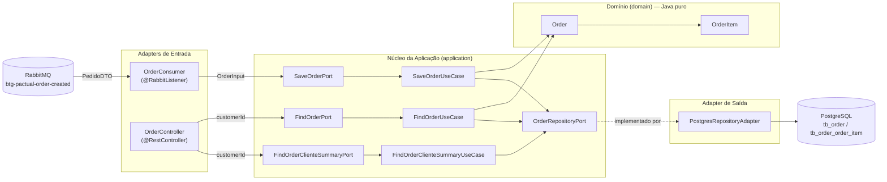
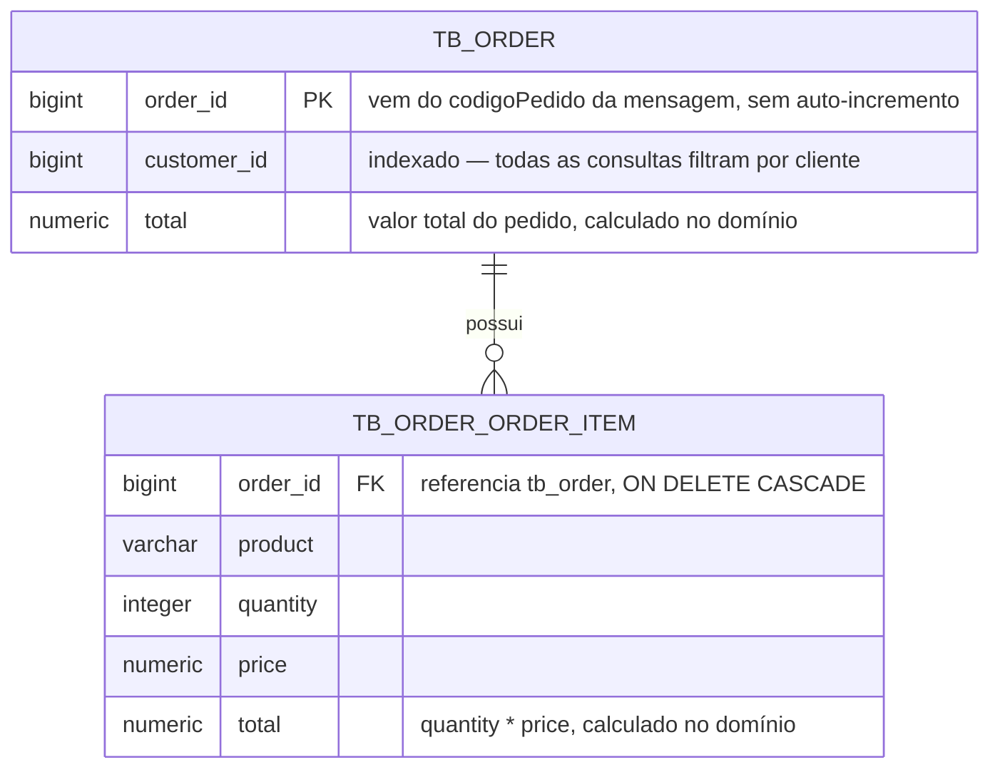
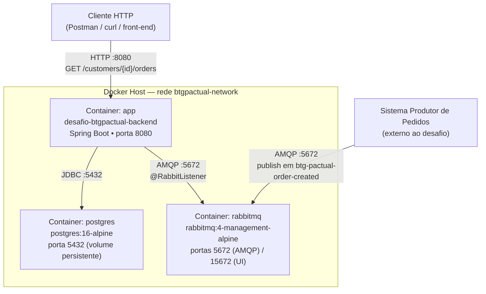
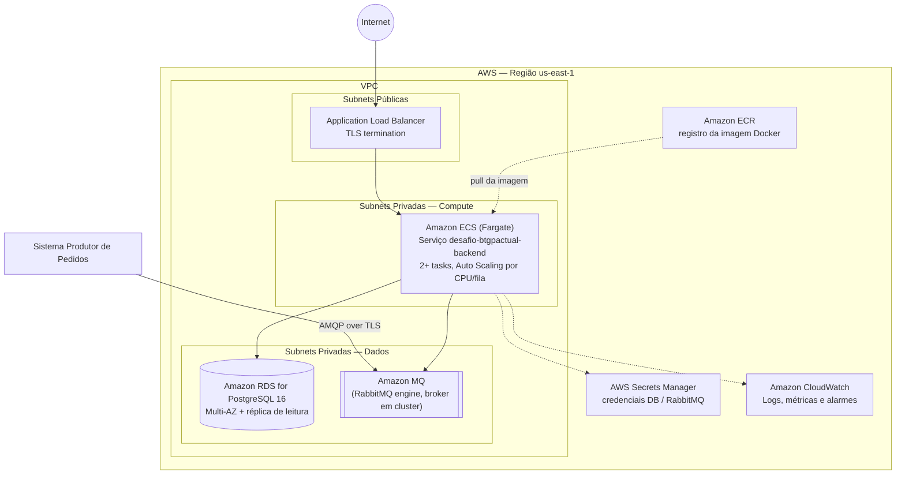

<p style="text-align: center;">

</p>

<h3 align="center">Desafio Engenheiro de Software Backend — BTG Pactual</h3>
<p style="text-align: center;">Processamento assíncrono de pedidos com RabbitMQ, PostgreSQL e Arquitetura Hexagonal</p>

<p style="text-align: center;">
<a href="https://sonarcloud.io/summary/new_code?id=erichiroshi_desafio-btgpactual-backend"></a>
  <a href="https://codecov.io/gh/erichiroshi/desafio-btgpactual-backend"></a>
  <a href="https://github.com/erichiroshi/desafio-btgpactual-backend/actions/workflows/build.yml"></a>
</p>

<p style="text-align: center;">
  
  
  
  
  
  
  
  
  
</p>

---

## 🧭 Visão Geral

Este projeto implementa a solução backend para o **desafio técnico de Engenheiro de Software do BTG Pactual**: um serviço que consome mensagens de pedidos de uma fila **RabbitMQ**, persiste os dados em **PostgreSQL** e expõe uma **API REST** para consulta de:

- 💰 Valor total de cada pedido;
- 🔢 Quantidade de pedidos por cliente;
- 📋 Lista de pedidos realizados por cliente.

A aplicação é um **monólito modular único** (o consumidor da fila e a API REST convivem no mesmo processo/deploy), construído com **Arquitetura Hexagonal (Ports & Adapters)**, isolando as regras de negócio de qualquer detalhe de infraestrutura (banco de dados, mensageria, framework web). As decisões de design deste README seguem o enunciado original — disponível na íntegra em [PROBLEM.md](PROBLEM.md).

> 📌 **Nota sobre a escolha do banco de dados**: o enunciado permite PostgreSQL, MySQL ou MongoDB. Optou-se por **PostgreSQL** por se tratar de dados fundamentalmente relacionais (pedido → itens do pedido, agregações por cliente), onde `SUM`/`COUNT` transacionais e integridade referencial (FK, índices) são vantagens diretas em relação a um modelo de documento.

---

## 📚 Sumário

- [🧭 Visão Geral](#-visão-geral)
- [🛠️ Stack Tecnológica](#️-stack-tecnológica)
- [💻 Linguagens, Versões, IDEs e SOs](#-linguagens-versões-ides-e-sos)
- [🏗️ Arquitetura](#️-arquitetura)
    - [Diagrama de Arquitetura Hexagonal](#diagrama-de-arquitetura-hexagonal)
    - [Fluxo de escrita (consumo da fila)](#fluxo-de-escrita-consumo-da-fila)
    - [Fluxo de leitura (API REST)](#fluxo-de-leitura-api-rest)
    - [Regras de dependência (ArchUnit)](#regras-de-dependência-archunit)
- [🗄️ Modelagem da Base de Dados](#️-modelagem-da-base-de-dados)
- [🚢 Diagrama de Implantação](#-diagrama-de-implantação)
- [☁️ Diagrama de Infraestrutura em Nuvem (Proposta)](#️-diagrama-de-infraestrutura-em-nuvem-proposta)
- [⚙️ Pré-requisitos](#️-pré-requisitos)
- [🚀 Quick Start](#-quick-start)
- [💬 Interagindo com a API](#-interagindo-com-a-api)
- [🧪 Evidência de Testes](#-evidência-de-testes)
- [🔧 Variáveis de Ambiente](#-variáveis-de-ambiente)
- [📁 Estrutura do Projeto](#-estrutura-do-projeto)
- [🐳 Imagem Docker](#-imagem-docker)
- [⚠️ Troubleshooting](#️-troubleshooting)
- [🤝 Contribuições](#-contribuições)
- [🔗 Referências e Créditos](#-referências-e-créditos)
- [Autor](#autor)

---

## 🛠️ Stack Tecnológica

| Categoria            | Tecnologia                          | Versão   | Papel                                              |
|-----------------------|-------------------------------------|----------|-----------------------------------------------------|
| Linguagem             | Java                                 | 25       | Linguagem principal (toolchain Gradle)              |
| Framework             | Spring Boot                         | 4.1.0    | Web MVC, DI, Actuator                               |
| Build                 | Gradle                              | 9.x      | Build, dependências, tasks de qualidade             |
| Persistência          | Spring Data JPA / Hibernate          | —        | Mapeamento objeto-relacional                        |
| Banco de dados        | PostgreSQL                          | 16       | Persistência relacional                             |
| Migração de schema    | Flyway                              | —        | Versionamento e migração do banco (`V1__...sql`)    |
| Mensageria            | RabbitMQ (Spring AMQP)              | 4        | Consumo assíncrono de pedidos                       |
| Observabilidade       | Spring Boot Actuator + Prometheus    | —        | Health checks e métricas (`/actuator/*`)             |
| Testes unitários      | JUnit 5 + Mockito + AssertJ          | —        | Domínio, casos de uso, adapters                     |
| Testes de integração  | Testcontainers                      | 2.0.4    | PostgreSQL real via container descartável            |
| Testes de arquitetura | ArchUnit                            | 1.4.2    | Garante as regras da arquitetura hexagonal           |
| Cobertura             | JaCoCo                              | —        | Relatório de cobertura, gate mínimo de 70%           |
| Qualidade estática    | SonarCloud                          | —        | Quality gate no pipeline de CI                       |
| Cobertura (relatório) | Codecov                             | —        | Publicação dos relatórios de cobertura/testes         |
| CI/CD                 | GitHub Actions                      | —        | Build, testes, análise estática a cada push/PR        |
| Containerização       | Docker / Docker Compose             | v2+      | Empacotamento e orquestração local                   |

---

## 💻 Linguagens, Versões, IDEs e SOs

| Item                          | Detalhe                                                                 |
|--------------------------------|--------------------------------------------------------------------------|
| Linguagem                     | Java 25 (LTS mais recente suportada pelo toolchain do Gradle)            |
| Build tool                    | Gradle 9 (via wrapper `./gradlew`, não requer instalação local)          |
| Framework                     | Spring Boot 4.1.0 (Spring Framework 7.x)                                 |
| IDE utilizada no desenvolvimento | IntelliJ IDEA (arquivo de projeto `.iml` versionado no repositório)   |
| IDEs compatíveis              | IntelliJ IDEA, VS Code (com Extension Pack for Java), Eclipse            |
| SO de desenvolvimento          | Windows 11 com Git Bash (terminal utilizado para Gradle/Docker/Git)      |
| SO de execução (runtime)       | Qualquer SO com Docker — imagem final baseada em `eclipse-temurin:25-jre-alpine` (Alpine Linux) |
| SO recomendado para deploy      | Linux (containers Alpine, mesma base usada em produção neste projeto)   |

A aplicação não possui nenhuma dependência de sistema operacional específico: todo o ambiente de execução (JDK, banco, fila) é provisionado via Docker, tornando o projeto portável entre Windows, Linux e macOS.

---

## 🏗️ Arquitetura

O projeto segue **Arquitetura Hexagonal (Ports & Adapters)** com três camadas bem definidas:

- **`domain`** — regras de negócio puras (`Order`, `OrderItem`). Não depende de Spring, JPA, Jackson ou qualquer framework — é Java puro (POJO).
- **`application`** — casos de uso (`SaveOrderUseCase`, `FindOrderUseCase`, `FindOrderClienteSummaryUseCase`) e as **portas**: `port.in` (contratos que a aplicação expõe para o mundo externo chamar) e `port.out` (contratos que a aplicação exige do mundo externo, como persistência).
- **`infrastructure`** — os **adapters** que plugam tecnologias concretas nas portas: `infrastructure.http` (adapter de entrada REST), `infrastructure.rabbitmq` (adapter de entrada por mensageria) e `infrastructure.persistence.postgres` (adapter de saída para PostgreSQL via JPA).

Essa separação garante que trocar o banco de dados (ex.: Postgres → MongoDB) ou o broker de mensageria (ex.: RabbitMQ → Kafka) exigiria apenas um novo adapter — nenhuma linha do domínio ou dos casos de uso precisaria mudar.

### Diagrama de Arquitetura Hexagonal



### Fluxo de escrita (consumo da fila)

1. Um sistema produtor publica uma mensagem JSON na fila `btg-pactual-order-created`.
2. `OrderConsumer` (adapter de entrada) recebe a mensagem já desserializada como `PedidoDTO`.
3. `PedidoDTO.toInput()` converte o payload externo (`codigoPedido`, `codigoCliente`, `itens`) para `OrderInput`, o formato de entrada da aplicação.
4. `SaveOrderUseCase` transforma o `OrderInput` no agregado de domínio `Order` e delega a persistência à porta `OrderRepositoryPort`.
5. `PostgresRepositoryAdapter` converte `Order` → `OrderEntity` e grava via Spring Data JPA.

### Fluxo de leitura (API REST)

1. O cliente HTTP chama `GET /customers/{id}/orders` ou `GET /customers/{id}/orders/summary`.
2. `OrderController` delega para as portas de entrada `FindOrderPort` / `FindOrderClienteSummaryPort` — nunca acessa repositórios ou adapters diretamente (garantido por teste de arquitetura, veja abaixo).
3. Os casos de uso consultam `OrderRepositoryPort`, que é resolvido em tempo de execução para `PostgresRepositoryAdapter`.
4. O resultado (`OrderOutput` / `SummaryOrdersCustomerOutput`) é convertido para os DTOs de resposta HTTP (`OrderResponse`, `SummaryCustomerOrderResponse`).

### Regras de dependência (ArchUnit)

A arquitetura não é apenas uma convenção de pastas — ela é **validada automaticamente a cada build** por [`HexagonalArchitectureTest`](src/test/java/com/erichiroshi/desafiobtgpactualbackend/architecture/HexagonalArchitectureTest.java), com 20 regras `@ArchTest`, entre elas:

- o pacote `domain` não pode depender de Spring, JPA, Jackson, Resilience4j, Micrometer ou Lombok;
- o pacote `domain` não pode depender de `application` nem de `infrastructure`;
- casos de uso (`application`) não podem depender de `infrastructure`;
- classes anotadas com `@Entity` ou `@RestController` só podem residir em `infrastructure`;
- classes terminadas em `Adapter` só podem residir em `infrastructure`;
- classes em `port.in`/`port.out` devem ser interfaces terminadas em `Port`;
- `OrderController` não pode depender de `*Adapter`, `*Repository` ou `*UseCase` concretos — apenas de portas.

Se qualquer uma dessas regras for violada, o build falha — a arquitetura é reforçada por código, não por revisão manual.

---

## 🗄️ Modelagem da Base de Dados

O schema é versionado via Flyway ([`V1__create_pedido_tables.sql`](src/main/resources/db/migration/V1__create_pedido_tables.sql)) e aplicado automaticamente na subida da aplicação.



Decisões de modelagem:

- **`order_id` não é auto-gerado** — o identificador do pedido vem sempre do campo `codigoPedido` da mensagem RabbitMQ, refletindo que o BTG Pactual é a fonte de verdade para esse identificador.
- **`tb_order_order_item`** é mapeada como `@ElementCollection`/`@Embeddable` (não uma entidade JPA própria) porque um item de pedido não tem identidade nem ciclo de vida independente do pedido — está sempre embutido em um `Order` (agregado no sentido de DDD).
- **Índices dedicados** em `customer_id` (`tb_order`) e `order_id` (`tb_order_order_item`) sustentam os três tipos de consulta pedidos no desafio: soma de valores, contagem e listagem, todos filtrados por cliente.
- **`ON DELETE CASCADE`** garante que remover um pedido remove seus itens, sem deixar registros órfãos.

---

## 🚢 Diagrama de Implantação

Implantação local/single-host via `docker-compose.prod.yml` — todos os serviços na mesma rede Docker (`btgpactual-network`):



O `docker-compose.prod.yml` define `depends_on` com `condition: service_healthy` para Postgres e RabbitMQ, e o próprio container da aplicação expõe um `HEALTHCHECK` no Dockerfile via `/actuator/health` — a API só começa a receber tráfego depois que suas dependências estão de fato prontas.

Para o **ambiente de desenvolvimento** (`docker-compose.dev.yml`), apenas a infraestrutura (Postgres, RabbitMQ e SonarQube local) sobe em container; a aplicação roda diretamente na máquina do desenvolvedor via `./gradlew bootRun`, permitindo hot-reload e debug direto na IDE.

---

## ☁️ Diagrama de Infraestrutura em Nuvem (Proposta)

> ⚠️ O desafio foi entregue rodando localmente via Docker Compose, conforme instruções do enunciado. O diagrama abaixo é uma **proposta de topologia produtiva na AWS**, mostrando como esta mesma imagem Docker evoluiria para um ambiente de nuvem gerenciado — nenhum destes recursos foi efetivamente provisionado para esta entrega.



Racional das escolhas:

| Recurso da imagem local        | Equivalente gerenciado proposto      | Motivo                                                              |
|---------------------------------|----------------------------------------|------------------------------------------------------------------------|
| Container `app` (Docker Compose)| Amazon ECS Fargate                     | Sem gestão de servidor/EC2; escala horizontalmente por task            |
| Container `postgres`            | Amazon RDS for PostgreSQL (Multi-AZ)   | Backups automáticos, failover gerenciado, patching                     |
| Container `rabbitmq`            | Amazon MQ (RabbitMQ)                   | Broker gerenciado com alta disponibilidade, sem operação manual de fila |
| Variáveis de ambiente `.env.prod` | AWS Secrets Manager                  | Segredos não versionados nem expostos em texto plano no host           |
| `docker logs` / Actuator local   | Amazon CloudWatch                    | Centralização de logs e métricas com alarmes                            |
| Build local da imagem            | Amazon ECR + pipeline no GitHub Actions | Imagem versionada e auditável, mesma pipeline de CI já existente     |

---

## ⚙️ Pré-requisitos

- **Java 25+** (apenas se for rodar fora do Docker via `bootRun`)
- **Docker + Docker Compose v2+**
- **Git**

> O Gradle não precisa ser instalado — o projeto já inclui o *wrapper* (`./gradlew` / `gradlew.bat`).

---

## 🚀 Quick Start

### 📥 Clonar o repositório

```bash
git clone https://github.com/erichiroshi/desafio-btgpactual-backend.git
cd desafio-btgpactual-backend
```

### Opção A — Modo desenvolvimento (API local + infra via Docker)

```bash
# 1. Sobe Postgres, RabbitMQ e SonarQube local
docker compose -f docker-compose.dev.yml --env-file .env.dev up -d

# 2. Roda a aplicação localmente, com hot-reload/debug na IDE
./gradlew bootRun --args='--spring.profiles.active=dev'
```

### Opção B — Modo produção (tudo via Docker, incluindo a aplicação)

```bash
docker compose -f docker-compose.prod.yml --env-file .env.prod up --build -d
```

A API sobe em [http://localhost:8080](http://localhost:8080) e o painel de gestão do RabbitMQ em [http://localhost:15672](http://localhost:15672) (usuário/senha definidos em `.env.dev`/`.env.prod`, veja [.env.example](.env.example)).

---

## 💬 Interagindo com a API

### 1. Publicando um pedido na fila

A aplicação **não expõe um endpoint HTTP para criar pedidos** — pedidos entram exclusivamente via mensagem na fila `btg-pactual-order-created`, conforme o contrato definido no desafio. Publique a mensagem abaixo pela UI do RabbitMQ (`http://localhost:15672` → *Queues* → `btg-pactual-order-created` → *Publish message*) ou por qualquer client AMQP:

```json
{
  "codigoPedido": 1001,
  "codigoCliente": 1,
  "itens": [
    { "produto": "lápis", "quantidade": 100, "preco": 1.10 },
    { "produto": "caderno", "quantidade": 10, "preco": 1.00 }
  ]
}
```

### 2. Consultando os dados via API REST

| Necessidade do desafio                 | Endpoint                                | Descrição                                                              |
|------------------------------------------|-------------------------------------------|--------------------------------------------------------------------------|
| Lista de pedidos por cliente + valor total de cada pedido | `GET /customers/{customerId}/orders`     | Retorna a página de pedidos do cliente, cada um já com seu `total`, e um resumo agregado do cliente |
| Quantidade de pedidos por cliente e valor total agregado  | `GET /customers/{customerId}/orders/summary` | Retorna `quantityOrders` e `total` agregados do cliente             |

```bash
# Lista de pedidos do cliente 1 (paginação Spring Data padrão: page, size, sort)
curl "http://localhost:8080/customers/1/orders?page=0&size=10"

# Resumo agregado do cliente 1 (quantidade de pedidos + valor total)
curl "http://localhost:8080/customers/1/orders/summary"
```

Exemplo de resposta de `GET /customers/1/orders`:

```json
{
  "summary": {
    "customerId": 1,
    "quantityOrders": 1,
    "totalAmountOrders": 120.00
  },
  "orders": {
    "content": [
      {
        "orderId": 1001,
        "customerId": 1,
        "total": 120.00,
        "items": [
          { "product": "lápis", "quantity": 100, "price": 1.10, "total": 110.00 },
          { "product": "caderno", "quantity": 10, "price": 1.00, "total": 10.00 }
        ]
      }
    ],
    "totalElements": 1,
    "totalPages": 1
  }
}
```

Exemplo de resposta de `GET /customers/1/orders/summary`:

```json
{
  "customerId": 1,
  "quantityOrders": 1,
  "total": 120.00
}
```

### 3. Health check e métricas

```bash
curl http://localhost:8080/actuator/health
curl http://localhost:8080/actuator/prometheus
```

---

## 🧪 Evidência de Testes

A suíte cobre as quatro camadas do projeto e é executada automaticamente a cada `push`/PR pela pipeline de CI ([`.github/workflows/build.yml`](.github/workflows/build.yml)), que roda `./gradlew clean build`, publica o relatório JaCoCo como artefato do workflow, envia cobertura e resultados de teste ao Codecov e roda a análise de qualidade no SonarCloud — os badges no topo deste README refletem o resultado da última execução na branch `main`.

| Camada testada                         | Classe de teste                                                                                      | Tipo                          | Nº de métodos |
|------------------------------------------|---------------------------------------------------------------------------------------------------------|--------------------------------|:---:|
| Domínio                                  | `OrderTest`, `OrderItemTest`                                                                            | Unitário puro                 | 9   |
| Casos de uso                             | `SalvaOrderUseCaseTest`, `BuscaOrderUseCaseTest`, `BuscaResumoPedidosClienteUseCaseTest`                | Unitário (Mockito)             | 5   |
| DTOs de entrada/saída                    | `OrderInputTest`, `OrderItemInputTest`, `OrderOutputTest`, `OrderItemOutputTest`, `OrderResponseTest`, `SummaryCustomerOrderResponseTest` | Unitário | 6 |
| Adapter HTTP                             | `OrderControllerTest`                                                                                    | `@WebMvcTest` (fatia web, MockMvc) | 2 |
| Adapter RabbitMQ                         | `OrderConsumerTest`, `OrderDTOTest`, `OrderItemDTOTest`                                                  | Unitário (Mockito)              | 3   |
| Adapter de persistência                  | `PostgresRepositoryAdapterTest`, `OrderEntityTest`, `OrderItemEntityTest`                                | Unitário (Mockito)              | 12  |
| Persistência (banco real)                | `OrderJpaRepositoryIT`                                                                                   | Integração — **Testcontainers** (PostgreSQL real em container) | 3 |
| Conformidade arquitetural                | `HexagonalArchitectureTest`                                                                              | **ArchUnit** — 20 regras de dependência entre camadas | 20 |
| **Total**                                |                                                                                                            |                                | **60** |

Gate mínimo de cobertura configurado no `build.gradle`: **70% de instruções cobertas** (`jacocoTestCoverageVerification`), verificado a cada build — abaixo disso, o build falha.

### Como reproduzir localmente

```bash
# Roda toda a suíte (unitário + integração + ArchUnit) e gera o relatório JaCoCo
./gradlew clean test jacocoTestReport

# Relatório HTML navegável
open build/reports/jacoco/test/html/index.html   # macOS
xdg-open build/reports/jacoco/test/html/index.html  # Linux
start build/reports/jacoco/test/html/index.html    # Windows

# Valida o gate mínimo de cobertura (70%)
./gradlew jacocoTestCoverageVerification
```

Os testes de integração (`OrderJpaRepositoryIT`) sobem um container PostgreSQL real via **Testcontainers** — é necessário ter o Docker em execução para rodá-los localmente; na CI, o mesmo papel é cumprido pelo Testcontainers Cloud.

### Teste funcional ponta a ponta (manual)

Com a stack no ar (`docker compose -f docker-compose.prod.yml --env-file .env.prod up --build -d`):

1. Publique a mensagem de exemplo da seção [Interagindo com a API](#-interagindo-com-a-api) na fila `btg-pactual-order-created` pela UI do RabbitMQ.
2. Confirme o consumo nos logs da aplicação: `docker logs -f desafio-btgpactual-backend` deve exibir `PedidoConsumer - Recebendo pedido` seguido de `UseCase - Pedido salvo`.
3. `curl http://localhost:8080/customers/1/orders/summary` deve retornar `quantityOrders: 1` e `total: 120.00`, validando o fluxo completo fila → domínio → banco → API.

---

## 🔧 Variáveis de Ambiente

O projeto usa três arquivos de ambiente (nenhum deles com segredos reais versionados):

- [`.env.example`](.env.example) — modelo com todas as variáveis necessárias, valores de exemplo.
- `.env.dev` — usado pelo `docker-compose.dev.yml`; credenciais de desenvolvimento (não sensíveis).
- `.env.prod` — usado pelo `docker-compose.prod.yml`; **substitua os valores `CHANGE-ME` antes de subir em um ambiente real.**

| Variável         | Descrição                                   |
|-------------------|------------------------------------------------|
| `POSTGRES_DB`     | Nome do banco de dados                          |
| `DB_URL`          | URL JDBC completa da aplicação                   |
| `DB_USERNAME`     | Usuário do PostgreSQL                            |
| `DB_PASSWORD`     | Senha do PostgreSQL                              |
| `RABBITMQ_HOST`   | Host do broker RabbitMQ                          |
| `RABBITMQ_PORT`   | Porta AMQP (padrão `5672`)                       |
| `RABBITMQ_USER`   | Usuário do RabbitMQ                              |
| `RABBITMQ_PASS`   | Senha do RabbitMQ                                |
| `SONAR_HOST_URL`  | URL da instância SonarQube/SonarCloud             |
| `SONAR_TOKEN`     | Token de autenticação do Sonar                    |

---

## 📁 Estrutura do Projeto

```
src/main/java/.../desafiobtgpactualbackend
├── domain
│   └── model                      # Order, OrderItem — Java puro, sem framework
├── application
│   ├── input / output              # DTOs internos da aplicação (não confundir com DTOs HTTP)
│   ├── port
│   │   ├── in                      # Contratos que a aplicação expõe (SaveOrderPort, FindOrderPort, ...)
│   │   └── out                     # Contratos que a aplicação exige (OrderRepositoryPort)
│   └── usecase                     # Implementações dos casos de uso (SaveOrderUseCase, ...)
└── infrastructure
    ├── http                        # OrderController + DTOs de request/response HTTP
    ├── rabbitmq                    # OrderConsumer, config da fila, DTOs da mensagem (PedidoDTO)
    └── persistence.postgres        # PostgresRepositoryAdapter, entidades JPA, migrations (Flyway)
```

---

## 🐳 Imagem Docker

O `Dockerfile` usa **multi-stage build**: estágio de build com `eclipse-temurin:25-jdk-alpine` (compila com Gradle, com cache de dependências) e estágio de runtime com `eclipse-temurin:25-jre-alpine` (imagem final enxuta, sem JDK/Gradle). A aplicação roda com usuário não-root (`btgpactual`) e possui `HEALTHCHECK` nativo via `/actuator/health`.

```bash
# Build local da imagem
docker build -t erichiroshi/desafio-btgpactual-backend:latest .

# Publicação no Docker Hub (perfil erichiroshi)
docker push erichiroshi/desafio-btgpactual-backend:latest
```

---

## ⚠️ Troubleshooting

| Sintoma                                                    | Causa provável                                            | Solução                                                                 |
|-------------------------------------------------------------|--------------------------------------------------------------|----------------------------------------------------------------------------|
| Aplicação não sobe / erro de conexão com o banco             | Postgres ainda inicializando quando a app tenta conectar     | Aguarde o `healthcheck` do `postgres` ficar `healthy`, ou suba primeiro `docker compose up postgres` |
| `403`/timeout ao publicar na fila                             | RabbitMQ ainda inicializando ou credenciais divergentes de `.env` | Confira `RABBITMQ_USER`/`RABBITMQ_PASS` e o status em `http://localhost:15672` |
| Mensagem publicada mas pedido não aparece na API              | Payload fora do contrato esperado (`codigoPedido`, `codigoCliente`, `itens`) | Verifique `docker logs -f desafio-btgpactual-backend`; erros de desserialização aparecem ali |
| `./gradlew` falha com `Permission denied` (Linux/macOS)       | Bit de execução não versionado corretamente                  | `chmod +x gradlew` antes de rodar                                          |
| Build falha em `jacocoTestCoverageVerification`               | Cobertura de instruções abaixo de 70%                          | Rode `./gradlew jacocoTestReport` e verifique o relatório HTML para localizar as classes sem cobertura |

---

## 🤝 Contribuições

Contribuições são sempre bem-vindas!

1. Crie um fork do repositório.
2. Crie uma branch de feature: `git checkout -b feature/nome-da-feature`
3. Siga o padrão de **Conventional Commits** (`feat:`, `fix:`, `test:`, `docs:`, ...) para as mensagens de commit.
4. Adicione testes para qualquer novo comportamento — o gate de cobertura mínima (70%) é validado no CI.
5. Envie um Pull Request.

---

## 🔗 Referências e Créditos

- Enunciado original do desafio: [PROBLEM.md](PROBLEM.md)
- Baseado no conteúdo do canal [Build & Run](https://www.youtube.com/watch?v=e_WgAB0Th_I&list=PLxCh3SsamNs7y1Y-QaVdWx0MUh0wvo7TV)
- [Documentação oficial do Spring Boot](https://docs.spring.io/spring-boot/4.1.0/)
- [Documentação do ArchUnit](https://www.archunit.org/)
- [Documentação do Testcontainers](https://testcontainers.com/)
- Licença: [MIT](LICENSE)

---

## Autor

Desenvolvido por **[Eric Hiroshi](https://github.com/erichiroshi)** — desenvolvedor backend Java, com foco em arquitetura hexagonal, Spring Boot e sistemas distribuídos.

<p style="text-align: center;">
  <em>"Código limpo é aquele que foi escrito com clareza, empatia e propósito."</em>
</p>